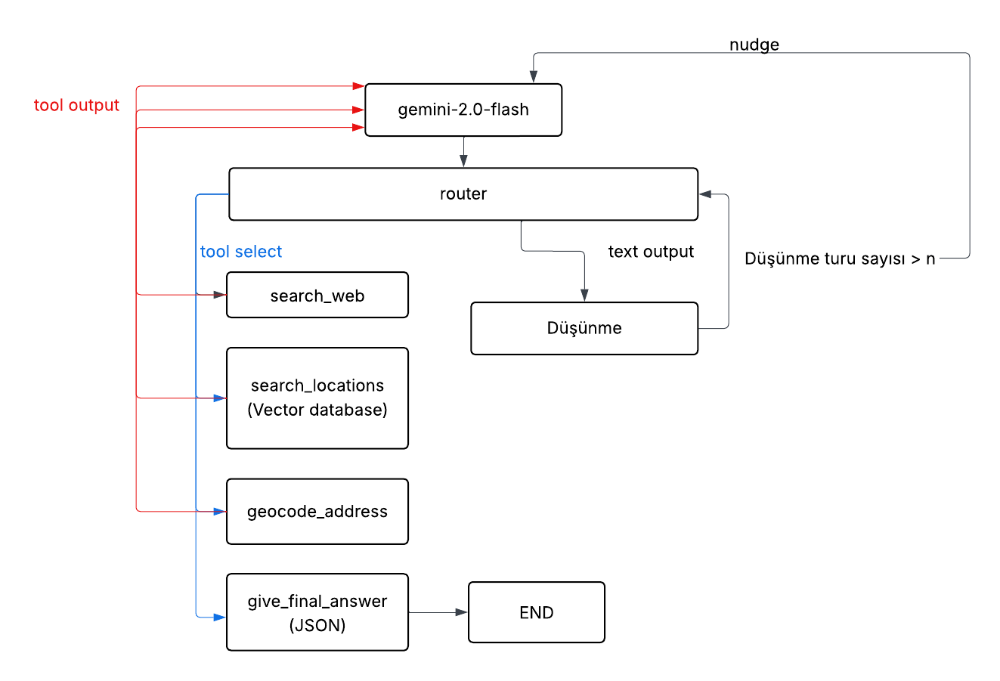

<h3>Pathway</h3>

  

<h4 align="center">
An AI-powered route recommendation application built with React, Expo, FastAPI, and LangGraph.
</h4>

---

### Overview

Pathway provides intelligent, personalized route recommendations based on each user's preferences and context. By leveraging agentic AI, the application combines multiple data sources with user-defined preferences to generate tailored navigation experiences. The goal is to make route planning more seamless, adaptable, and user-centric by providing recommendations that are both reliable and intuitive.

### Tech Stack

- **Frontend:** React, Expo
- **Backend:** FastAPI
- **LLM:** Google Gemini API
- **AI Frameworks:** LangChain, LangGraph
- **Database:** PostgreSQL + Supabase Vector Database
- **Maps & Geocoding:** Mapbox

### Developers

- **Zeynep Cansu Akgül** (@cansuakgl)
- **Nesibe Ebrar Çimen** (@nesibeebrarcimen)
- **Gülçin Sağbaş** (@gulcin0)

### Status

> **Note:** The Agentic AI API is currently offline and will be available again in a future update.

#### Agent Architecture Preview

  

